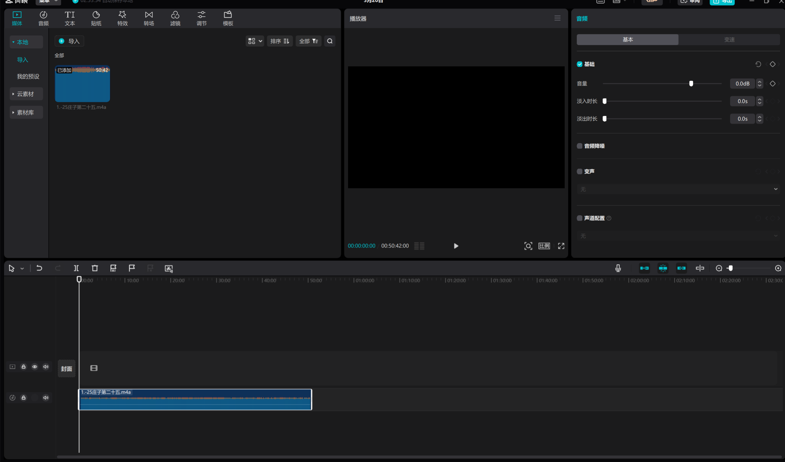
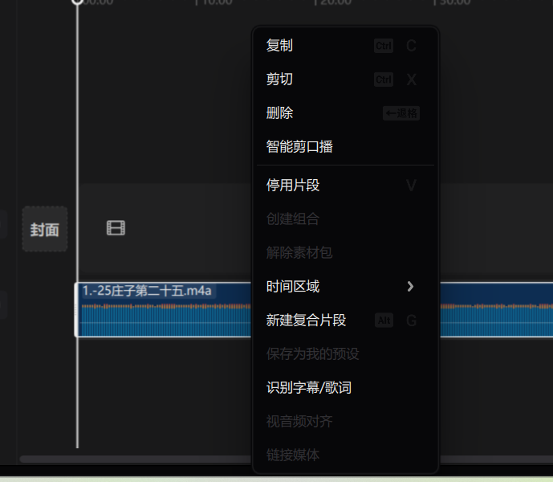

## 如何从音频视频文件自动生成字幕

### 简述

用喜马拉雅听讲座的时候发现没有文稿，虽然也可以听，但有时候讲的不太清楚的地方还是需要有声音，于是自己开始摸索语音转文字的方法。

### 方法一  视频自带AI文稿（只适用于喜马拉雅）

喜马拉雅部分作者开启了字幕功能，是可以生成AI文稿的，一般只有手机上提供此功能

### 方法二  Clipchamp  自动字幕功能

Clipchamp 是微软推出的一款视频剪辑软件，楼主使用的win11自己附带了这个软件，自己可以也必应搜索官网下载。甚至也有网页版，[官网传送门](https://app.clipchamp.com/login "官网传送门")

#### 步骤一

下载并打开Clipclamp软件，点击创新新视频

（好像是个electron应用，打开有点慢）

#### 步骤二

导入需要添加字幕的视频或者音频

#### 步骤三

1. 拖动素材到操作区，

2. 并打开自动字幕，设置字幕识别语言

3. 等待字幕生成完毕，之后可以选择导出为srt

   

   （素材名称前的圈跑完，实际速度看素材大小以及个人网络连接情况，）

### 方法三 剪映识别字幕功能（推荐，中文友好）

#### 步骤一

下载并安装剪映，[官网传送门](https://www.capcut.cn/)

#### 步骤二

点击开始创作  并导入素材

拖动到操作区

#### 步骤三

右键素材，选择识别字幕/歌词，等待一段时间，识别完成后会自动添加字幕轨道（楼主识别的是简体中文，英文也应该是支持的）

右上角可以选择导出字幕为srt或者txt文件。

## 总结

之后碰到没有字幕的，应该会使用剪映的识别字幕功能，面对大文件速度上要快很多。
